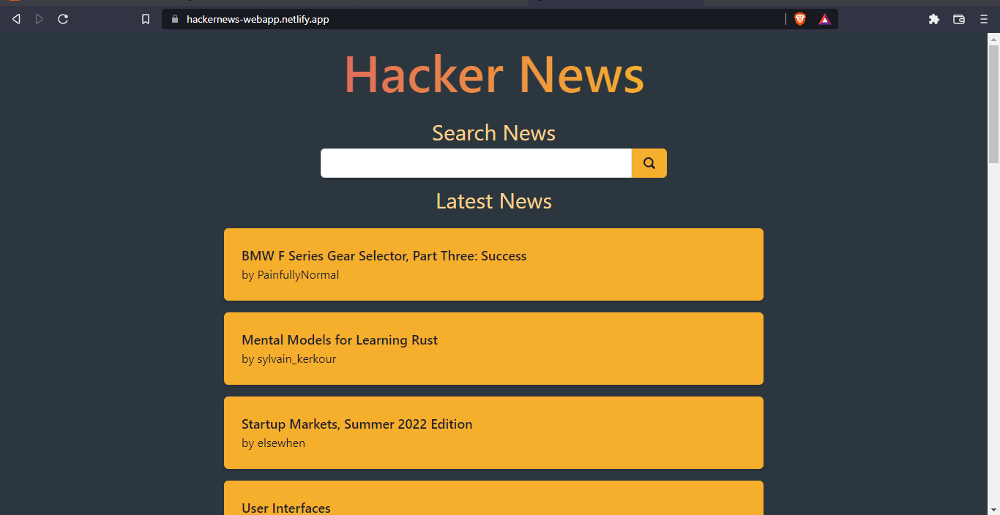
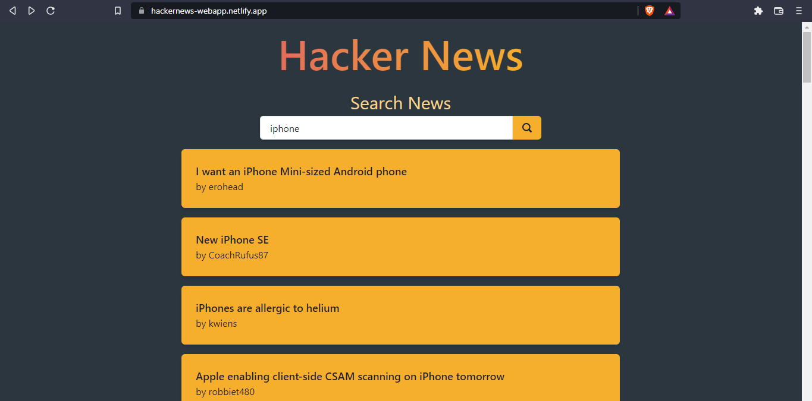
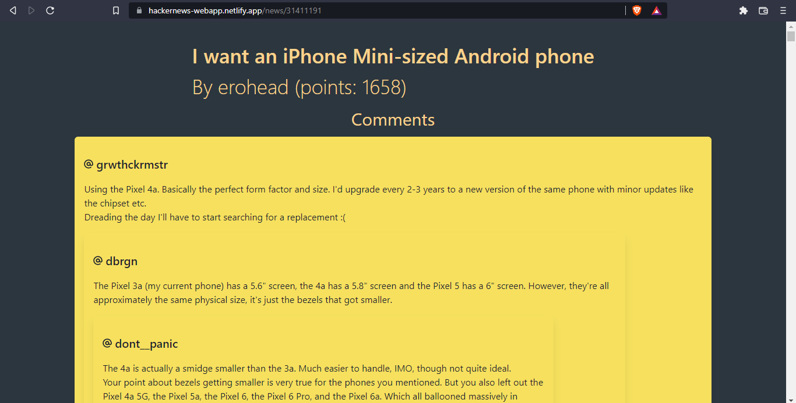

# This is hacker news web application 

link to live website - (https://hackernews-webapp.netlify.app/)

** NOTE: allow insecure content in your browser from site settings, to use website as intended. 
This is because API used for the application is non-https **

## Instructions to use the application

#### you can search news and click on title to see news details

#### you can see news details here, which includes title, author, points and comments

